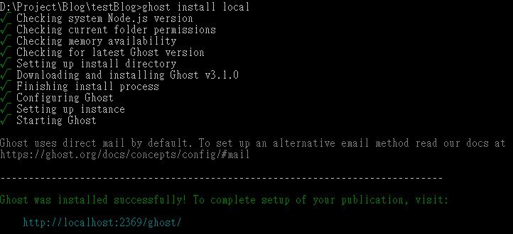
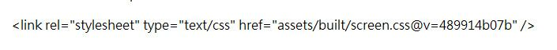
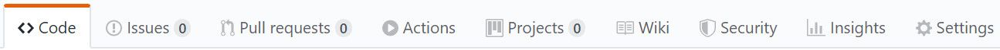
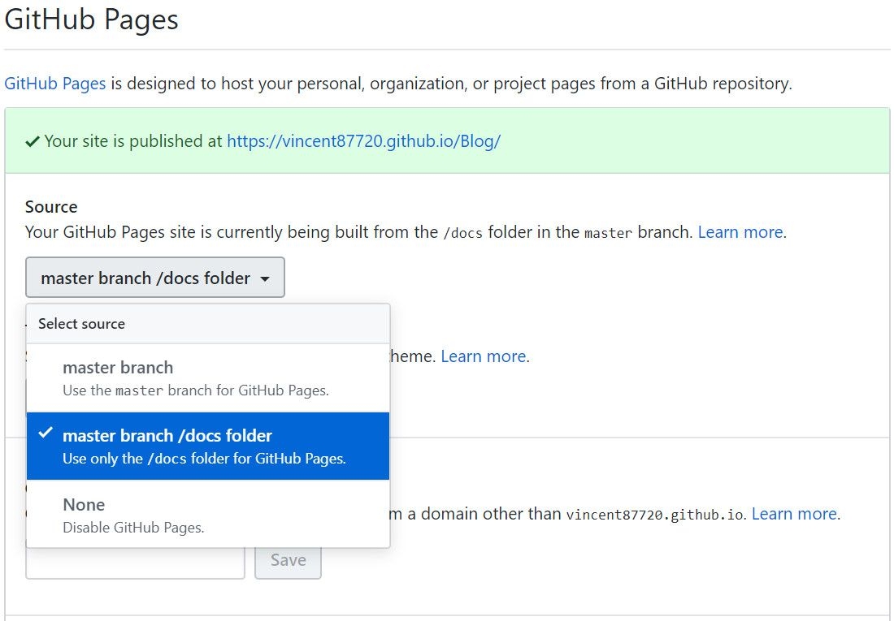

一直以來都有個困擾，就是查個程式寫法或是軟體操作方法每次都很快就忘記，所以想寫個Blog紀錄自己的手順，先前曾想過直接寫個網頁PUSH到GitHub上，但實在有點累( ˘･з･)，偶然又看到有個很喜歡的排版是用Ghost建立的，因此使用Ghost+GitHub的形式建立部落格

---

## 安裝Ghost

### 安裝Ghost-CLI‌‌
使用npm或yarn指令安裝Ghost-CLI
```
npm install ghost-cli@latest -g
```

### 初始化Ghost‌‌目錄
開啟終端機，移動到要建立Ghost的目錄並使用指令安裝Ghost
```
ghost install local
```




安裝完成後開啟git bash切換到同一目錄並初始化目錄

```
git init
git add -A
git commit -m "Initial repository"
```

安裝npm並更新repository

```
npm install
git add -A
git commit -m 'Installed Node dependencies'
```

安裝knex-migrator並更新repository

```
npm install -g knex-migrator
```

初始化資料庫

```
knex-migrator
```

## 設定Ghost

移動到已安裝Ghost的目錄並輸入指令開啟Ghost
```
ghost start
```

一般使用`http://localhost:2368/ghost`開啟Ghost的管理介面，但因為先前已經在另一個地方裝過一個Ghost，所以畫面顯示以`http://localhost:2369/ghost/`開啟管理介面


填寫網站名稱及作者基本資料


可輸入email邀請其他作者一起協作，只有自己使用的話則按下方直接進入管理介面


更新repository

```
git add -A
git commit -m 'Finished local Ghost setup'
```

## 將網頁輸出為檔案

使用wget輸出網頁到docs資料夾內
- --mirror : 鏡像下載所有檔案相當於-N -r -l inf --no-remove-listing選項
    - -N : 若遠端檔案較新則下載檔案
    - -r : 遞迴下載
    - -l : 最大搜尋深度(0或inf表示無限)
    - --no-remove-listing : 不刪除.listing檔案
- --convert-links : 轉換檔案內路徑為符合本地目錄的路徑
- --page-requisites : 下載所有顯示網頁所需的檔案，例如圖片等
- -nH : 不建立名稱為網站名稱的目錄，直接在當前目錄建立檔案
- --no-parent : 不進入上層目錄
- -P : 指定下載目錄

```
wget --mirror --convert-links --page-requisites -nH --no-parent -P docs http://localhost:2368/
```

由於從Ghost抓下來的css、js的檔名和html內的相關路徑都會被加上類似下圖.css後方的字串，若直接傳到GitHub Pages上的話會讀不到，我們可使用Notepad++將目錄中所有檔案中有包括此字串的替換為空字串



開啟Notepad++，點選**在檔案中尋找**


輸入要刪除的字串並按下在多個檔案中取代


更改docs/assets內built、css和js資料夾內所有包含該字串的檔名


更新repository

```
git add -A
git commit -m "Export website to docs file;"
```

## PUSH檔案到GitHub

設定遠端倉庫
```
git remote add origin <webURL|SSH Key>
```

將master分支推送到origin倉庫
```
git push -u origin master
```

## 設定GitHub Pages

進入剛剛上傳的GitHub的Repository，點選settings標籤


尋找GitHub Pages區塊，選擇master branch /docs folder作為網頁來源



## 已可瀏覽網頁

在網址列輸入`http://帳號.github.io/RepositoryName`即可瀏覽網頁