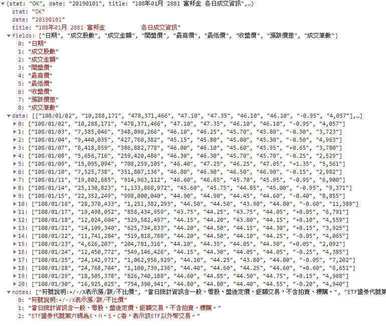

使用python抓取網站或網頁資料是再方便不過的了，常見的抓取方法包含抓取網站回應的JSON檔，或是直接抓取網頁內容並進行分析，以下紀錄兩種方法該如何實作。

## 建立請求

載入requests模組以建立HTTP請求

```python
import requests
```

建立GET請求

```python
url = '' //填入目標網址以取得網頁內容
resp = requests.get(url) //建立get請求
```

## 解析請求

### 目標為JSON

使用json()方法解析內容，返回值(data)為字典

```python
data = resp.json()
```

### 目標為HTML網頁內容

需使用BeautifulSoup模組裡的方法，使用以下指令載入該模組

```python
from bs4 import BeautifulSoup
```

使用BeautifulSoup(htmlMarkup,'html5lib')方法解析網頁內容，返回值(soup)為<class 'bs4.BeautifulSoup'>

```python
soup = BeautifulSoup(resp.text,'html5lib')
```

## 取得內容

### 目標為JSON

以台灣證券交易所-201901月個股日成交資訊為例，網址為[https://www.twse.com.tw/exchangeReport/STOCK_DAY?response=json&date=20190101&stockNo=2881](https://www.twse.com.tw/exchangeReport/STOCK_DAY?response=json&date=20190101&stockNo=2881)，該請求返回的內容如下圖



需使用Pandas模組裡的方法，使用以下指令載入該模組

```python
import pandas as pd
```

我們需要取得data裡的0~20所有資訊做為內容，將其放入pandas的dataframe裡，並使用fields作為其欄位的標籤

```python
# data[]為先前取得的資料，型態為字典
df = pd.DataFrame(data['data'],columns = data['fields'])
```

若要使用foreach迴圈讀取或印出dataframe的內容時，需使用df.values作為範圍，若只使用df作為範圍會得到錯誤的結果

```python
for row in df:
    print(row)
```

```shell
>日期
成交股數
成交金額
開盤價
最高價
最低價
收盤價
漲跌價差
成交筆數
```

```python
for row in df.values:
    print(row)
```

```shell
>['108/10/01' '8,895,183' '399,156,974' '44.85' '45.00' '44.75' '45.00' '+0.45' '3,310']
['108/10/02' '4,399,985' '196,735,002' '44.55' '44.85' '44.55' '44.75' '-0.25' '1,745']
    ...
['108/10/31' '17,527,040' '787,119,996' '45.40' '45.40' '44.55' '44.55' '-0.90' '5,017']
```

### 目標為HTML網頁內容
類別為'bs4.BeautifulSoup'的物件可使用以下方法

find()	//查詢第一筆符合的資料
find(htmlTag)	//查詢標籤類型為htmlTag的第一筆元素
find(id='elementID')	//查詢id為elementID的元素
find(htmlTag,class_='className')	//查詢標籤為htmlTag且class為className的第一筆元素
find(htmlTag,className)	//查詢標籤為htmlTag且class為className的第一筆元素

find_all()	//查詢所有符合的元素
find_all(htmlTag)	//查詢所有符合標籤類型為htmlTag的元素
find_all(id='elementID')	//查詢id為elementID的元素
find_all(htmlTag,class_='className')	//查詢標籤為htmlTag且class為className的所有元素
find_all(htmlTag,className)	//查詢標籤為htmlTag且class為className的所有元素

若使用find_all()查詢，可使用foreach迴圈歷遍所有查找到的元素

```python
for content in soup.find_all('li'):
    print(content.string)
```

使用.string方法取得元素的內容

```python
soup = BeautifulSoup('<h1 id="thisish1">content</h1>', 'html5lib')
print(soup.h1)
```

```shell
><h1 id="thisish1">content</h1>
```

```python
soup = BeautifulSoup('<h1 id="thisish1">content</h1>', 'html5lib')
print(soup.h1.string)
```

```shell
>content
```

使用get('href')方法取得元素的href屬性

```python
soup = BeautifulSoup('<h1 href="katsuobushi.com">content</h1>', 'html5lib')
print(soup.h1.get('href'))
```

```shell
>katsuobushi.com
```

## 輸出為檔案

### 輸出為csv檔案

需載入os及csv模組以使用open及writer方法

```python
import os
import csv
```

使用w模式開啟檔案，w模式為打開一個文件只用於寫入，若文件已存在則打开文件，並從頭開始編輯，原有内容會被刪除。若文件不存在，則創建新文件。

```python
file = open(filepath,'w',newline='',encoding='utf-8-sig')
```

使用csv.writer()創建一個writer

```python
csvWriter = csv.writer(file)
```

writerow()方法可將一列資料寫入到檔案中

```python
csvWriter.writerow(row)
```

寫入完畢後須關閉檔案，釋放資源

```python
file.close()
```