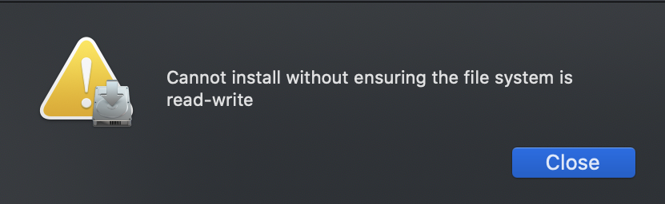

## 版本
- OS：macOs Catalina  Version 10.15.3
- Clover：Clover_v2.5k_r5104

## 問題
在開啟Clover時會跳出"Cannot install without ensuring the file system is read-write"錯誤訊息

## 解決方法及步驟
1. Click the Apple symbol in the Menu bar.
2. Click Restart…
3. Hold down Command-R to reboot into Recovery Mode.
4. Click Utilities.
5. Select Terminal.
6. Type csrutil disable.
7. Press Return or Enter on your keyboard.
8. Click the Apple symbol in the Menu bar.
9. Click Restart…

###### 參考資料
- [Clover - Cannot Install w/o Ensuring File System is Read/Write](https://www.reddit.com/r/hackintosh/comments/d9pbhy/clover_cannot_install_wo_ensuring_file_system_is/?utm_source=embedv2&utm_medium=post_embed&utm_content=post_title&embed_host_url=https://vincent87720.github.io/clover-package-err/index.html)