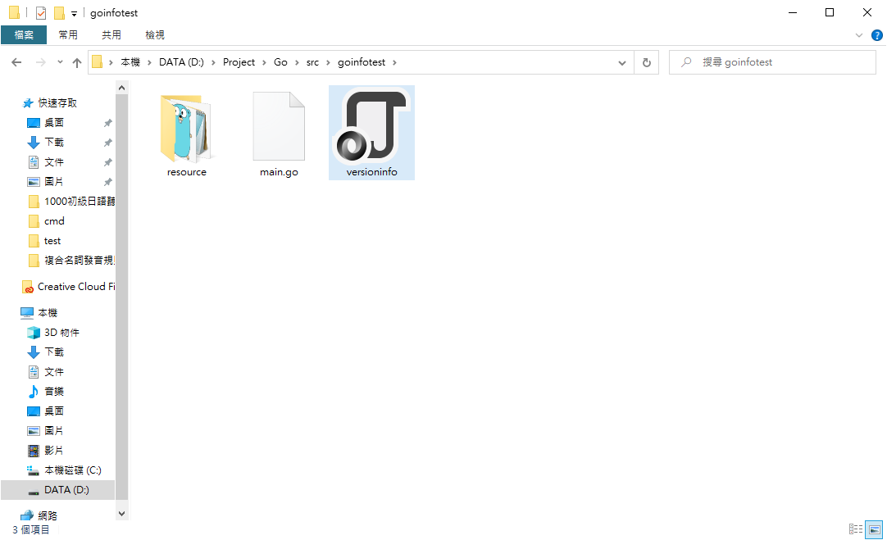
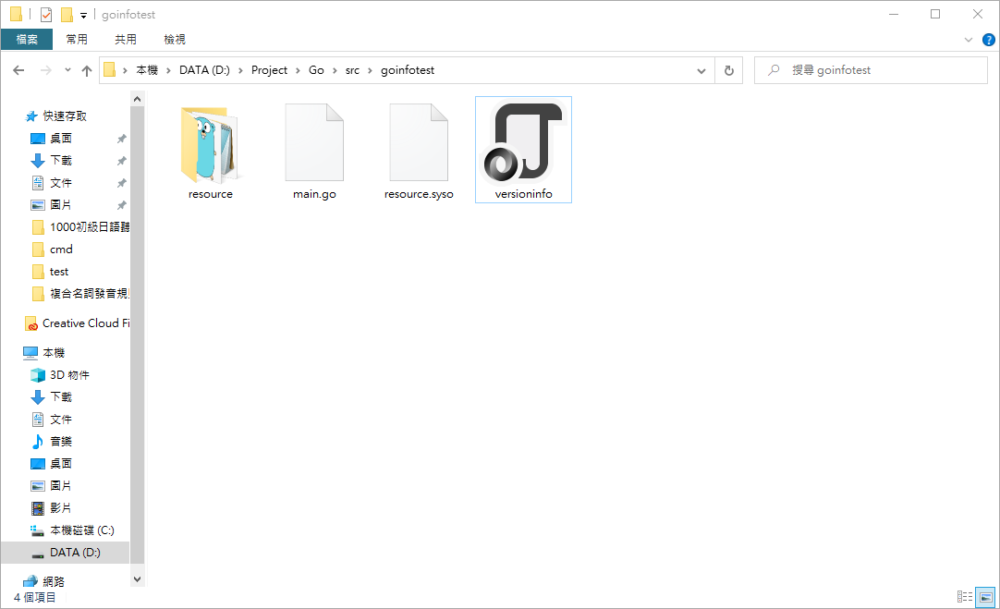
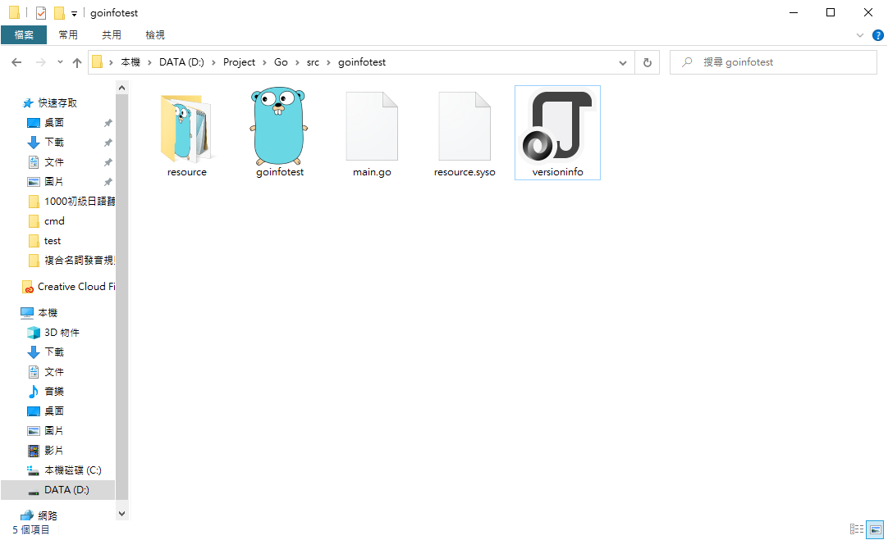

GoVersionInfo package可在生成執行檔時指定執行檔縮圖及檔案屬性，檔案描述、檔案類型、版本等參數皆可指定

## 安裝

### 使用指令安裝package
```go
go get github.com/josephspurrier/goversioninfo/cmd/goversioninfo
```

### 產生可執行檔
```go
go build -o bin/goversioninfo.exe github.com/josephspurrier/goversioninfo/cmd/goversioninfo
```

`-o bin/goversioninfo.exe`代表要將產生出來的可執行檔放在bin目錄裡，並將檔名命名為goversioninfo.exe

空一格後面接`github.com/josephspurrier/goversioninfo/cmd/goversioninfo`代表要以這個package為目標產生可執行檔

## 設定

### 設定go generate註釋

將`//go:generate goversioninfo`加入到程式碼的最頂端，往後在執行`go generate`命令時才能夠被搜尋到

```go
//go:generate goversioninfo

package main

import "fmt"

func main() {
    fmt.Println("Hello world")
}
```

### 設定versioninfo.json檔案
在`github.com\josephspurrier\goversioninfo\testdata\resource`內有一個檔名為versioninfo的json檔，將其複製並放置於要產生執行檔的程式碼的目錄中

resource資料夾內有icon和goversioninfo.exe.manifest兩個檔案，等等在設定versioninfo時會用到



### 指定versioninfo.json檔案參數
將IconPath和ManifestPath的路徑指定為可執行檔圖示的路徑和Manifest檔案的路徑

```json
{
    "FixedFileInfo": {
        "FileVersion": {
            "Major": 1,
            "Minor": 0,
            "Patch": 0,
            "Build": 0
        },
        "ProductVersion": {
            "Major": 1,
            "Minor": 0,
            "Patch": 0,
            "Build": 0
        },
        "FileFlagsMask": "3f",
        "FileFlags ": "00",
        "FileOS": "040004",
        "FileType": "01",
        "FileSubType": "00"
    },
    "StringFileInfo": {
        "Comments": "Test file.",
        "CompanyName": "josephspurrier",
        "FileDescription": "This is a hello world file.",
        "FileVersion": "v1.0.0.0",
        "InternalName": "goversioninfo.exe",
        "LegalCopyright": "Copyright (c) 2019 Joseph Spurrier",
        "LegalTrademarks": "",
        "OriginalFilename": "main.go",
        "PrivateBuild": "",
        "ProductName": "goversioninfo",
        "ProductVersion": "v1.0.0.0",
        "SpecialBuild": ""
    },
    "VarFileInfo": {
        "Translation": {
            "LangID": "0409",
            "CharsetID": "04B0"
        }
    },
    "IconPath": "resource/icon.ico",
    "ManifestPath": "resource/goversioninfo.exe.manifest"
}
```

### 產生syso檔
輸入go generate指令產生resource.syso檔案，若不在同個目錄內可指定package路徑，例如主程式在D:\Project\Go\src\goinfotest，若當前位置在目錄內直接下go generate即可，若不在目錄內則要輸入go generate+從src目錄後開始算的package路徑(go generate goinfotest)產生syso檔

```go
go generate
go generate your\package\route
```



### 產生可執行檔
使用go build產生可執行檔，亦可使用"go build -o 目的路徑與檔名 +package路徑"產生可執行檔

```go
go build
go build -o output\route your\package\route
```

