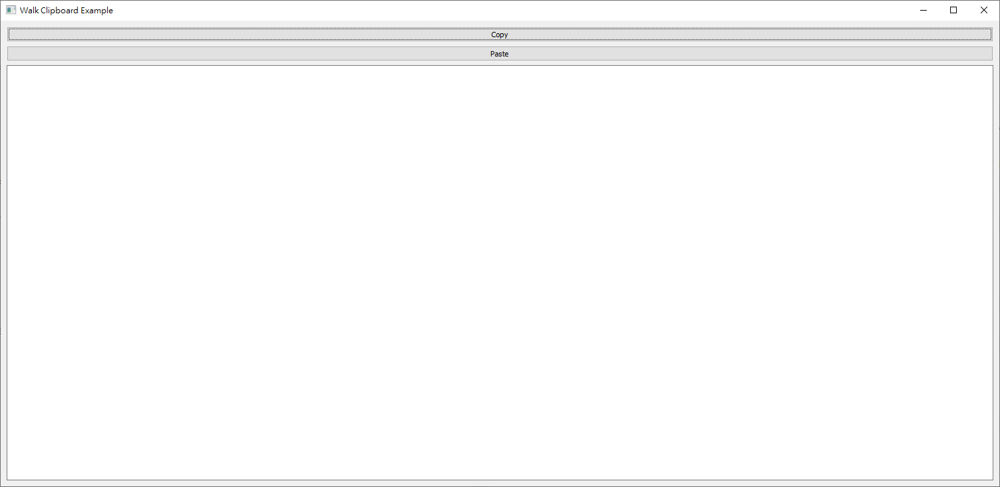

golang 普遍使用CLI作為使用者介面，但因為需要做一個程式給不常使用指令的人使用，所以使用lxn/walk建立圖形化使用者介面，lxn/walk可以滿足視窗的大部分需求，適用於建立一些基本的圖形化介面

## 環境
- Windows 10 x64
- go 1.15
- github.com/lxn/walk v0.0.0-20200806153934-8721e9bc9ff7
- github.com/akavel/rsrc v0.9.0

## 安裝
要將程式包裝成可執行檔需要兩個package，分別是lxn/walk和akavel/rsrc
lxn/walk用來建立圖形化介面
akavel/rsrc用來將資源嵌入可執行檔
使用指令安裝lxn/walk和akavel/rsrc
```
go get github.com/lxn/walk
go get github.com/akavel/rsrc
```

## 結構
在lxn/walk下包含了declarative sub package、範例檔和各種元件的檔案
```
－github.com
    |－lxn
        |－walk
            |－declarative
            |－examples
            |...其他檔案
```
以examples下的action範例裡的一小段程式碼為例
```
PushButton{
	AssignTo: &toggleSpecialModePB,
	Text:     "Enable Special Mode",
	OnClicked: func() {
		isSpecialMode.SetSatisfied(!isSpecialMode.Satisfied())

		if isSpecialMode.Satisfied() {
			toggleSpecialModePB.SetText("Disable Special Mode")
		} else {
			toggleSpecialModePB.SetText("Enable Special Mode")
		}
	},
	Accessibility: Accessibility{
		Help: "Toggles special mode",
	},
},
```
很好奇PushButton裡面的這些參數到底是哪裡來的對吧
讓我們看看declarative目錄下的pushbutton.go檔案  

**pushbutton.go**
```
package declarative

import (
	"github.com/lxn/walk"
)

type PushButton struct {
	// Window

	Accessibility      Accessibility
	Background         Brush
	ContextMenuItems   []MenuItem
	DoubleBuffering    bool
	Enabled            Property
	Font               Font
	MaxSize            Size
	MinSize            Size
	Name               string
	OnBoundsChanged    walk.EventHandler
	OnKeyDown          walk.KeyEventHandler
	OnKeyPress         walk.KeyEventHandler
	OnKeyUp            walk.KeyEventHandler
	OnMouseDown        walk.MouseEventHandler
	OnMouseMove        walk.MouseEventHandler
	OnMouseUp          walk.MouseEventHandler
	OnSizeChanged      walk.EventHandler
	Persistent         bool
	RightToLeftReading bool
	ToolTipText        Property
	Visible            Property

	// Widget

	Alignment          Alignment2D
	AlwaysConsumeSpace bool
	Column             int
	ColumnSpan         int
	GraphicsEffects    []walk.WidgetGraphicsEffect
	Row                int
	RowSpan            int
	StretchFactor      int

	// Button

	Image     Property
	OnClicked walk.EventHandler
	Text      Property

	// PushButton

	AssignTo       **walk.PushButton
	ImageAboveText bool
}
```
這邊清楚的定義了哪些元件可以用哪些參數，只要照著結構裡定義的屬性名稱和型別給予對應的數值就可以了

## 建置與執行

要執行圖形化介面無法直接使用go run執行
必須在相同目錄下新增.manifest檔案並使用go build建置產生可執行檔
再啟動可執行檔執行
我們使用examples下的clipboard作為範例  

**clipboard.go**
```
// Copyright 2013 The Walk Authors. All rights reserved.
// Use of this source code is governed by a BSD-style
// license that can be found in the LICENSE file.

package main

import (
	"log"
)

import (
	"github.com/lxn/walk"
	. "github.com/lxn/walk/declarative"
)

func main() {
	var te *walk.TextEdit

	if _, err := (MainWindow{
		Title:   "Walk Clipboard Example",
		MinSize: Size{300, 200},
		Layout:  VBox{},
		Children: []Widget{
			PushButton{
				Text: "Copy",
				OnClicked: func() {
					if err := walk.Clipboard().SetText(te.Text()); err != nil {
						log.Print("Copy: ", err)
					}
				},
			},
			PushButton{
				Text: "Paste",
				OnClicked: func() {
					if text, err := walk.Clipboard().Text(); err != nil {
						log.Print("Paste: ", err)
					} else {
						te.SetText(text)
					}
				},
			},
			TextEdit{
				AssignTo: &te,
			},
		},
	}).Run(); err != nil {
		log.Fatal(err)
	}
}
```
**test.manifest**
```
<?xml version="1.0" encoding="UTF-8" standalone="yes"?>
<assembly xmlns="urn:schemas-microsoft-com:asm.v1" manifestVersion="1.0">
    <assemblyIdentity version="1.0.0.0" processorArchitecture="*" name="SomeFunkyNameHere" type="win32"/>
    <dependency>
        <dependentAssembly>
            <assemblyIdentity type="win32" name="Microsoft.Windows.Common-Controls" version="6.0.0.0" processorArchitecture="*" publicKeyToken="6595b64144ccf1df" language="*"/>
        </dependentAssembly>
    </dependency>
    <application xmlns="urn:schemas-microsoft-com:asm.v3">
        <windowsSettings>
            <dpiAwareness xmlns="http://schemas.microsoft.com/SMI/2016/WindowsSettings">PerMonitorV2, PerMonitor</dpiAwareness>
            <dpiAware xmlns="http://schemas.microsoft.com/SMI/2005/WindowsSettings">True</dpiAware>
        </windowsSettings>
    </application>
</assembly>
```
建立一個目錄並在目錄底下放置clipboard.go和test.manifest兩個檔案
```
－walktest
    |－clipboard.go
    |－test.manifest
```
第一次要使用指令產生.syso檔
```
rsrc -manifest test.manifest -o rsrc.syso
```
再輸入指令建置可執行檔
```
go build
```
運行可執行檔就會出現圖形化介面了
```
walktest.exe
```
