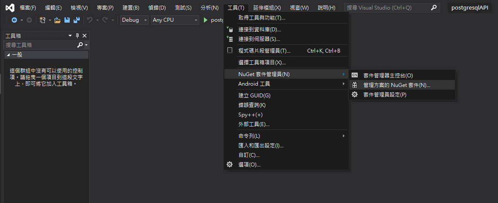
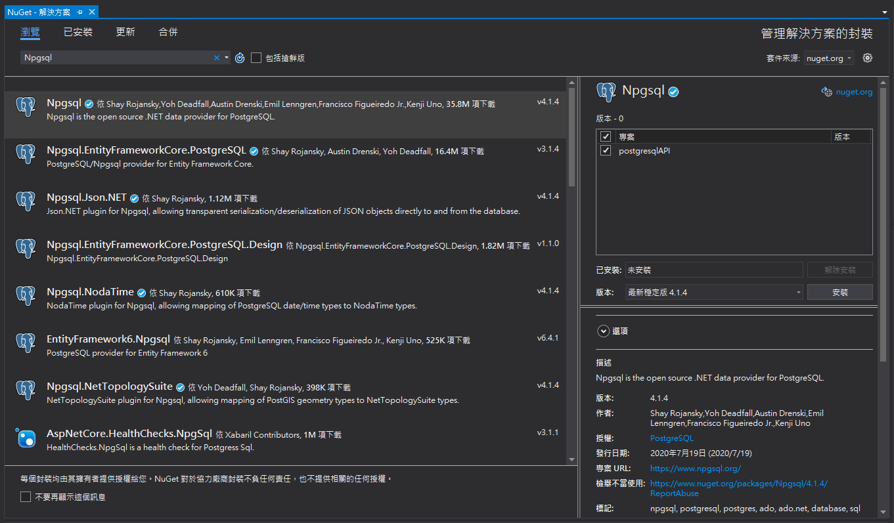
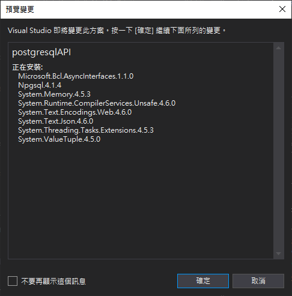

## 環境
- Windows 10 x64
- Visual Studio Community 2019 v16.2.2
- Npgsql v4.1.4

## 安裝
開啟visual studio後點選"**工具**->**NuGet套件管理員**->**管理方案的NuGet套件**"  

點選Npgsql，勾選右方會執行到此套件的專案，再點選安裝

按確定進行安裝


## 建立連線
設定好`host` `post` `username` `password` `database`等連線資訊後，使用`NpgsqlConnection`建立一個新連線，再使用Open()方法開啟連線
``` csharp
class Program
{
    
    static void Main(string[] args)
    {
        string host = "localhost";
        string port = "5432";
        string username = "postgres";
        string password = "password";
        string database = "postgis";
        string connStr = $"Host={host};Port={port};Username={username};Password={password};Database={database};";
        using (NpgsqlConnection pgconn = new NpgsqlConnection(connStr))
        {
            pgconn.Open();
        }

    }
}
```

## 執行查詢
### 方法一：使用NpgsqlDataReader讀取資料
執行查詢必須用到先前建立好的連線和即將要執行的查詢式
```csharp
class Program
{
    static void Main(string[] args)
    {
        ExecuteQuery("SELECT id,x,y FROM users;");
    }
    
    public static void ExecuteQuery(string sqlstr)
    {
        using (var pgconn = new NpgsqlConnection(connStr))
        {
            pgconn.Open();
            using (var cmd = new NpgsqlCommand(sqlstr, pgconn))
            {
                using (var reader = cmd.ExecuteReader())//使用NpgsqlDataReader讀取資料
                {
                    while (reader.Read())//讀取下一列直到沒有數值
                    {
                        Console.Write(reader.GetInt32(0));//0代表該列第0行的值，也就是對應到查詢式中的id
                        Console.Write(reader.GetDouble(1));//1代表該列第1行的值，也就是對應到查詢式中的x
                        Console.WriteLine(reader.GetDouble(2));//2代表該列第2行的值，也就是對應到查詢式中的y
                    }
                }
            }
        }
    }
    private static string host = "localhost";
    private static string port = "5432";
    private static string username = "postgres";
    private static string password = "password";
    private static string database = "postgis";
    private static string connStr = $"Host={host};Port={port};Username={username};Password={password};Database={database};";
}
```

### 方法二：使用NpgsqlDataAdapter將資料放入DataTable
```csharp
class Program
{
    static void Main(string[] args)
    {
        DataTable dt = ExecuteQuery("SELECT id,x,y FROM sptable;");

        foreach (DataRow row in dt.Rows)
        {
            Console.WriteLine("{0} {1} {2}", row[0], row[1], row[2]);//輸出該行的0,1,2個值，分別為id,x,y的值
        }
    }
    public static DataTable ExecuteQuery(string sqlstr)
    {
        using (NpgsqlConnection pgconn = new NpgsqlConnection(connStr))
        {
            pgconn.Open();

            DataTable dt = new DataTable();//建立一個DataTable

            try
            {
                using (NpgsqlDataAdapter sqladap = new NpgsqlDataAdapter(sqlstr, pgconn))
                {
                    sqladap.Fill(dt);//使用NpgsqlDataAdapter將資料放入DataTable中
                }
                return dt;//返回DataTable
            }
            catch (Exception ex)
            {
                Console.WriteLine(ex.ToString());
                return dt;
            }
        }
    }
    private static string host = "localhost";
    private static string port = "5432";
    private static string username = "postgres";
    private static string password = "password";
    private static string database = "postgis";
    private static string connStr = $"Host={host};Port={port};Username={username};Password={password};Database={database};";
}
```