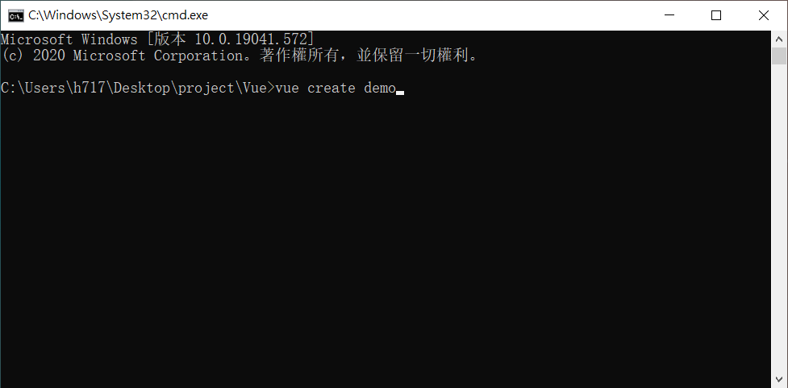
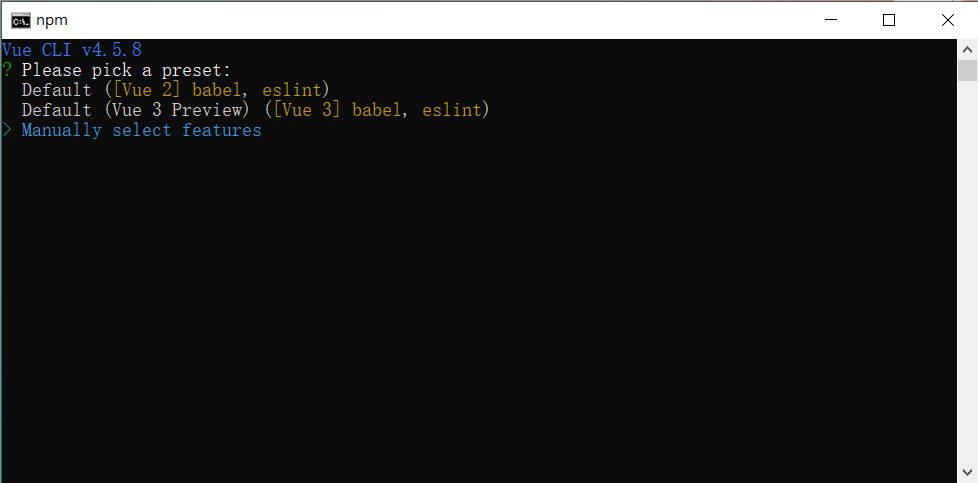
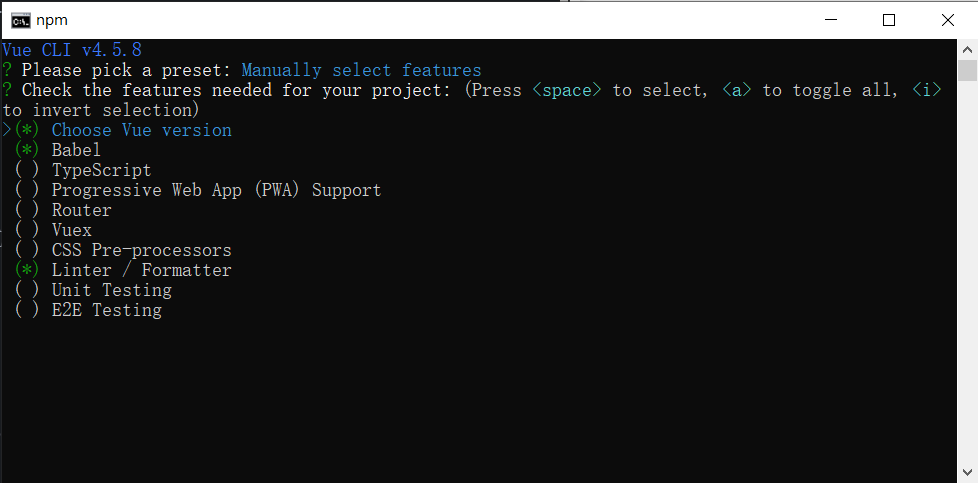
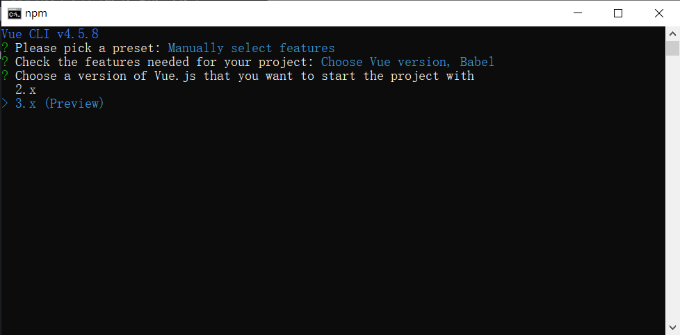
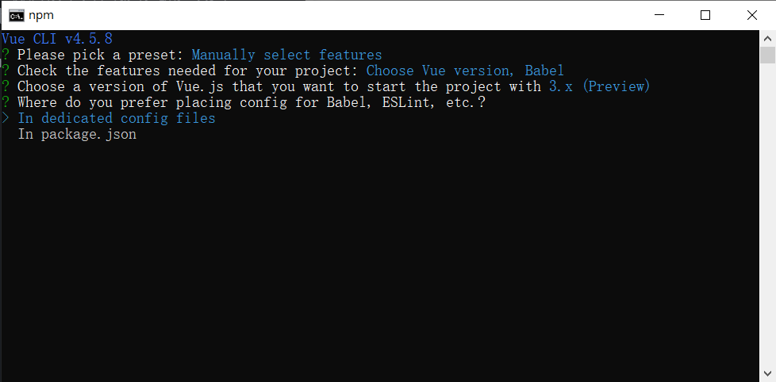
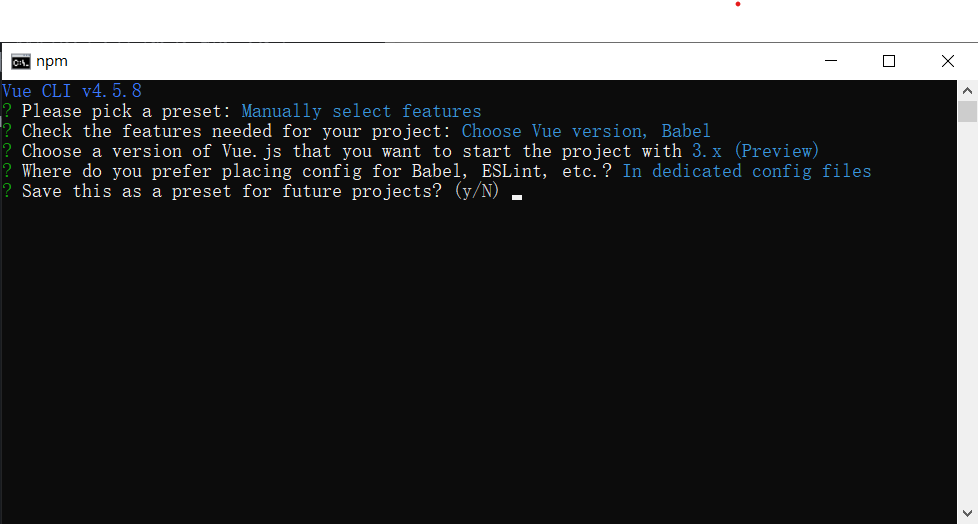
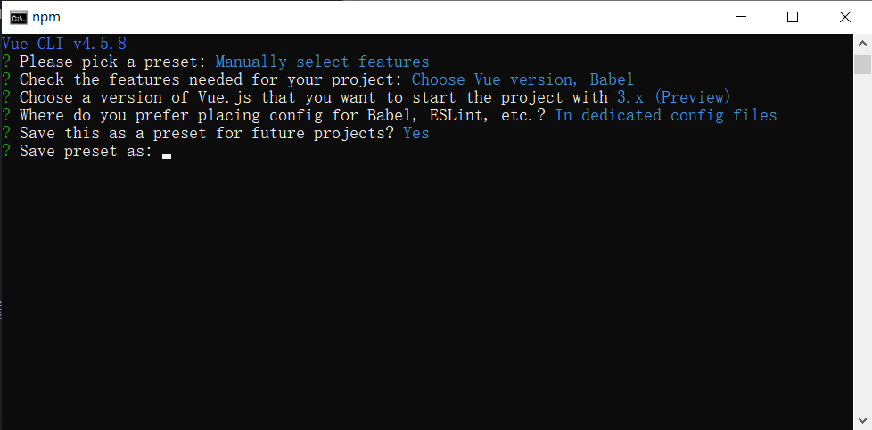
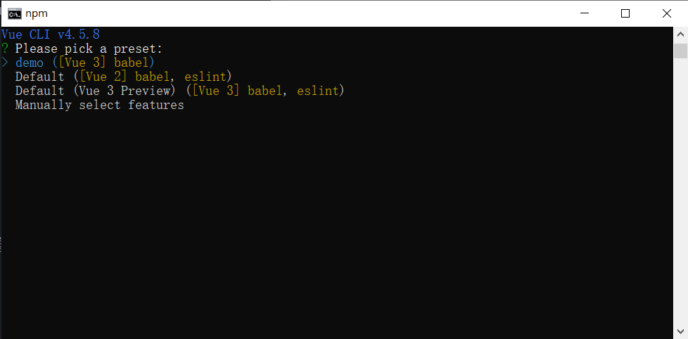
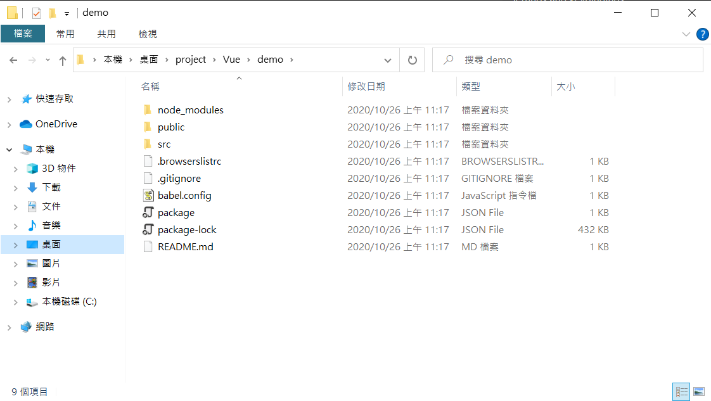
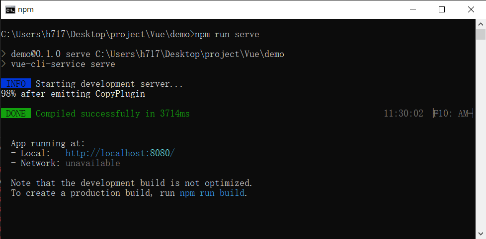

在之前的課堂裡，我們都是直接開一個html檔案然後把vue寫在裡頭，這次助教介紹了Vue CLI，Vue CLI是一個官方出的工具，可以直接開一個測試用的伺服器，讓開發更方便，並且可以將程式碼打包，方便某些情況下的部署

## 環境
- Windows10 x64 2004
- Node.js - v12.19.0
- Vue - @vue/cli 4.5.8

## 下載並安裝VueCLI
開啟終端機並輸入指令進行安裝
```shell=cmd
npm install -g @vue/cli
```
輸入指令驗證VueCLI版本
```shell=cmd
vue -V
```
## 建立Vue專案

開啟終端機並輸入指令開啟建立專案程式，指令中的`<name>`使用自行定義的專案名稱替換掉
```shell=cmd
vue create <name>
```


選擇要使用哪項模式建立專案，我們使用Manually select features進行自定義設定


預設會有三個選項已被勾選，為了防止一直報錯，我們按下方向鍵移動選項到Linter / Formatter並按下空白鍵，暫時將此選項取消勾選

接著移動到Choose Vue version並按下Enter鍵選擇Vue版本


這裡我們選擇使用Vue3的版本


接著選擇In dedicated config files選項


輸入y後按下Enter確認以上安裝資訊


若要將本次的選擇儲存成預設設定可填入名稱紀錄本次設定，下次在下vue create指令時就可以選擇此次的設定建立專案



建立好專案後就可以在目錄內看到Vue的專案檔案了

## 設定Vue專案
為了確保可以正確讀取assets的內容，我們需要修改@vue/cli-serve/lib/option.js內的參數或是以新增vue.config.js檔案的方式進行設定
[Vue配置参考](https://cli.vuejs.org/zh/config) [VueCli設定](http://wm.dyu.edu.tw/testweb/myWeb/)
- 於Public資料夾下新增tools資料夾
- 在專案**根目錄**新增vue.config.js檔案，並輸入以下內容
```javascript
module.exports = {
    productionSourceMap:false,
    indexPath: 'index.html',
    assetsDir: 'tools',
    publicPath : ''
}
```

## 啟動開發者模式伺服器
開啟終端機並輸入指令
```shell=cmd
npm run serve
```

出現Done就代表完成了，點選下方網址便可以使用瀏覽器觀看專案內網頁的狀態囉

## 打包檔案
當我們寫好網頁之後，我們可以使用build指令將檔案打包，便可以部屬到伺服器上了
```shell=cmd
npm run build
```
執行之後在根目錄裡面出現dist資料夾就是已經打包好的檔案囉