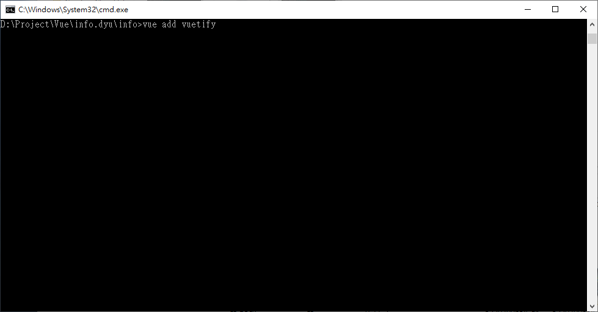
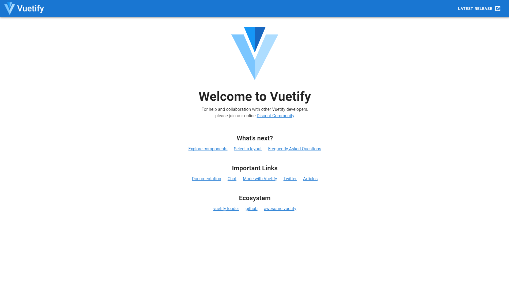

Vuetify是一個Vue的UI框架，有許多精美和現成的組件可讓我們快速進行網頁排版及呈現，由於這篇文章撰寫時vuetify尚未支援Vue3，所以本篇文章以Vue2為例，示範如何將vuetify加入到Vue2專案中

## 環境
- Windows10 x64 2004
- Node.js - 6.12.1
- Vue - @vue/cli 4.5.8
- vue-cli-plugin-vuetify@2.0.7

## 建立Vue專案
在使用Vuetify之前必須先建立Vue專案，建立專案的方法請參考[[Vue]使用Vue CLI建立專案](https://vincent87720.github.io/vue-vuecli-init)

## 將Vuetify加入到專案
切換到專案根目錄，並開啟終端機輸入指令，將Vuetify加入到專案
```shell
vue add vuetify
```

選擇`Default (recommended)`

安裝完成後在終端機輸入指令啟動開發者模式
```shell
npm run serve
```

成功啟動後會顯示網址，在瀏覽器網址列輸入網址即可瀏覽目前專案的狀態
在瀏覽器輸入網址執行後，若出現以下畫面代表安裝成功
