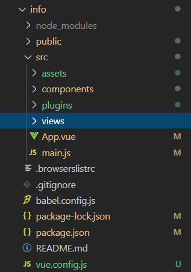
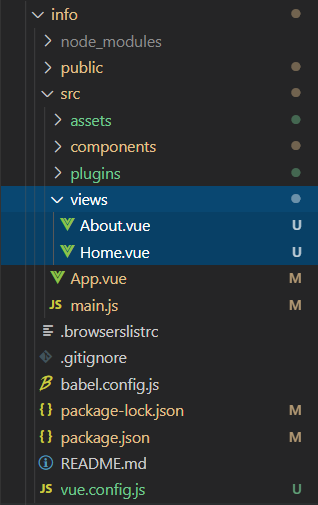
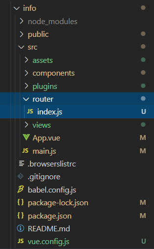
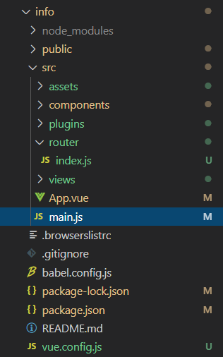
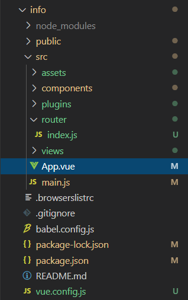
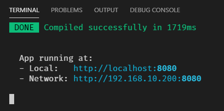
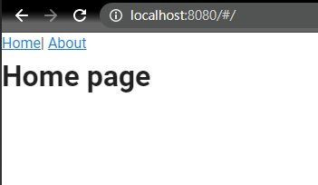
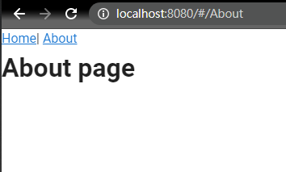

在使用vue時，有時會需要在畫面中切換component，這時vue-router就派上用場啦，vue-router常常被用在single-page application中，這次的期中專題因為要將舊網頁變成single-page app，所以必須先了解如何將vue-router加入到專案中，方便後續使用

## 環境
- Windows10 x64 2004
- Node.js - v12.19.0
- Vue - @vue/cli 4.5.8
- vue-router@3.4.9

## 安裝Vue-Router
要將Vue-Router加入到專案可使用CDN嵌入，或是使用npm安裝

### CDN
在`<head></head>`標籤中加入下面這行標籤即可將Vue-Router加入到專案
```htmlmixed
<head>
    <script src="https://unpkg.com/vue-router/dist/vue-router.js"></script>
</head>
```

### npm
開啟終端機，並輸入以下指令，即可安裝Vue-Router
```shell
npm install vue-router
```

## 建立Vue專案
在使用Vue-Router之前建議先建立Vue專案，建立專案的方法請參考[[Vue]使用Vue CLI建立專案](https://vincent87720.github.io/vue-vuecli-init)

## 加入component
在已建立好的專案中尋找src資料夾，並在src目錄下新增views目錄

在views目錄中放入想要進行切換的component，這邊以Home.vue和About.vue進行示範

**Home.vue**
```htmlmixed
<template>
  <div class="home">
    <h1>Home page</h1>
  </div>
</template>

<script>
export default {

}
</script>

```

**About.vue**
```htmlmixed
<template>
  <div class="about">
    <h1>About page</h1>
  </div>
</template>

<script>
export default {

}
</script>

```

## 建立路由目錄與檔案
接著在src目錄下新增router資料夾，並新增index.js檔案

在檔案中可自由新增或刪除component，並配置component對應的路由

**index.js**
```javascript
import Vue from 'vue'
import VueRouter from 'vue-router'

//這裡可以自行import需要的component
import Home from '../views/Home.vue'
import About from '../views/About.vue'

Vue.use(VueRouter)

//建立路由routes
const routes = [
    {
        path: '/',
        component: Home
    },
    {
        path: '/About',
        component: About
    }
]

//建立Vue-Router的instance，並將routes的配置帶入
const router = new VueRouter({
    mode: 'hash',
    routes
})
//匯出成模組給Vue使用
export default router

```

## 匯入路由

在`main.js`中加入以下指令載入router模組
```javascript
import router from './router'
```
並在new Vue中加入router
```javascript
new Vue({
  router,
  render: h => h(App)
}).$mount('#app')
```

**main.js**
```javascript
import Vue from 'vue'
import App from './App.vue'
import router from './router'

Vue.config.productionTip = false

new Vue({
  router,
  render: h => h(App)
}).$mount('#app')

```

## 加入路由連結
在`App.vue`中加入Home和About的連結

```javascript
<router-link to="/">Home</router-link>|
<router-link to="/About">About</router-link>
<router-view></router-view>
```

**App.vue**
```htmlmixed
<template>
  <v-app>
    <v-main>
      <router-link to="/">Home</router-link>|
      <router-link to="/About">About</router-link>
      <router-view></router-view>
    </v-main>
  </v-app>
</template>

<script>

export default {
  name: 'App',

  components: {
  },

  data: () => ({
    //
  }),
};
</script>
```
到這裡我們已經建立好路由了，接著我們使用開發者模式查看成果

## 啟動開發者模式
在終端機輸入命令啟動開發者模式
```shell
npm run serve
```


依照指示在瀏覽器輸入網址

## 完成
現在已可使用連結切換component!


