在使用MQTT進行資料傳遞時，會需要一個代理人，也就是MQTT Broker，作為訂閱/發布的橋樑，Mosquitto Server是一個開源的MQTT的Server，本篇筆記紀錄在Windows下如何安裝並開啟MQTT Server

## 環境
- Windows10 x64 2004
- mosquitto-1.6.12a

## 下載
進入[Mosquitto-Download](https://mosquitto.org/download/)下載頁面進行下載
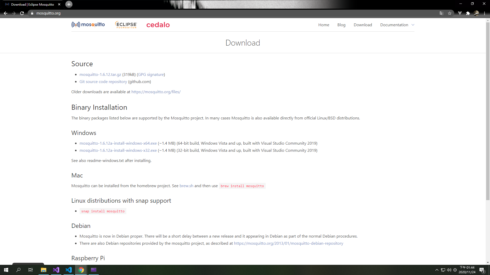

## 安裝
點擊已下載完成的安裝檔進行安裝
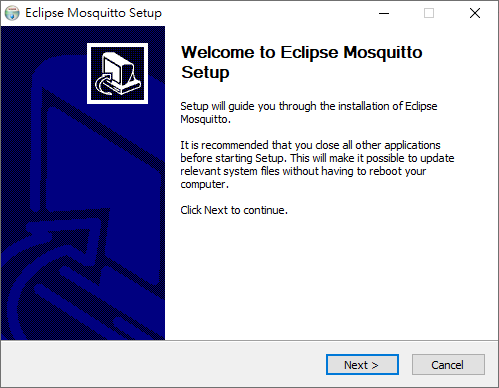

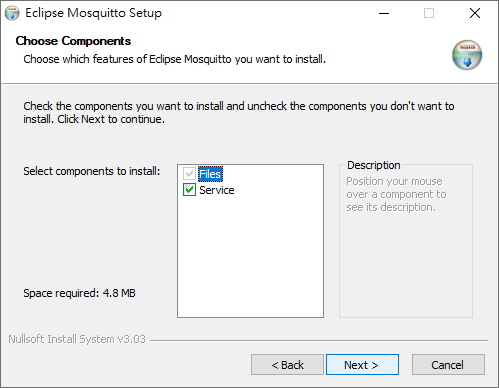

可選擇安裝路徑
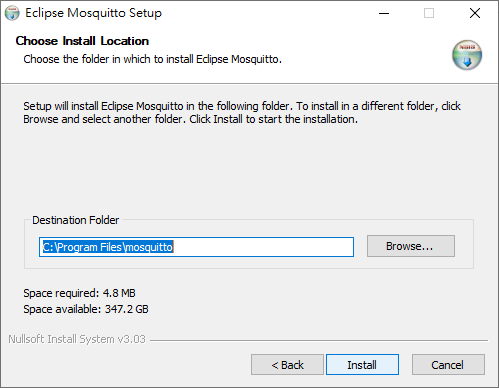

安裝完成
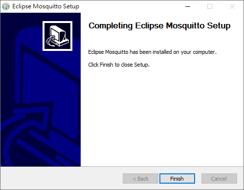

## 啟動
使用**工作管理員**或**執行**開啟**服務**功能

### 使用工作管理員開啟服務
在開始列點選右鍵，點擊"工作管理員"以開啟
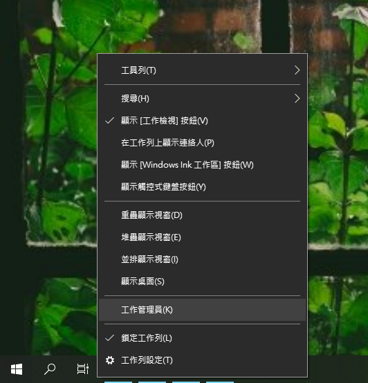

### 使用執行開啟服務
按下快捷鍵`windows+R`並輸入services.msc開啟服務功能
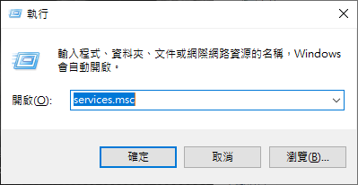

尋找mosquitto並點選右鍵啟動服務
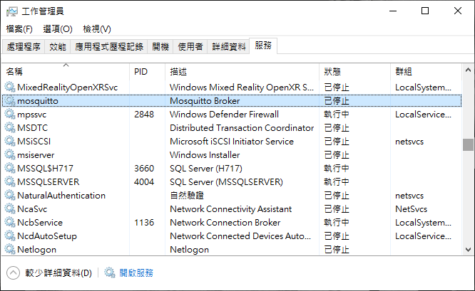

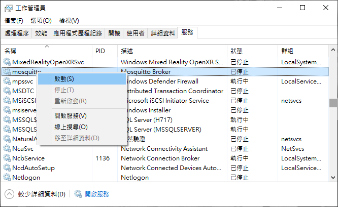

## 查看伺服器狀態
在終端機輸入`netstat -an`查看作用中的連線，以檢查伺服器是否正常運行
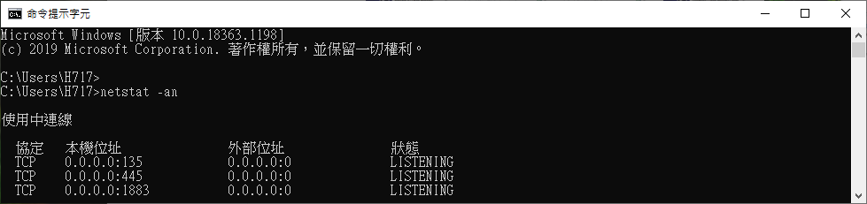

## 在防火牆中開啟連接埠
進入控制台 > 系統及安全性 > Windows Defender防火牆 > 進階設定，或直接按下快捷鍵`windows+R`並輸入WF.msc，開啟**具有進階安全性的 Windows Defender 防火牆**

在**輸入規則**中點選新增規則
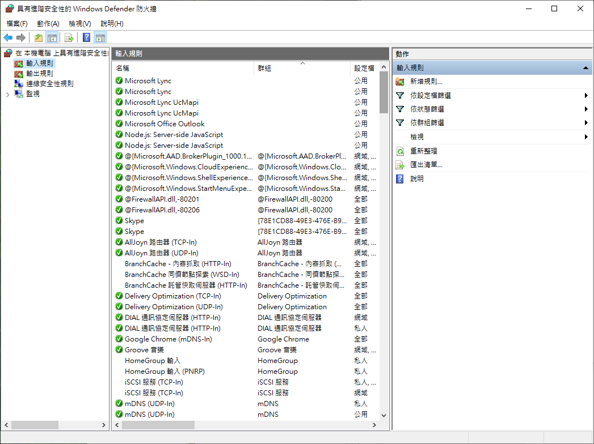

建立指定連接埠的規則
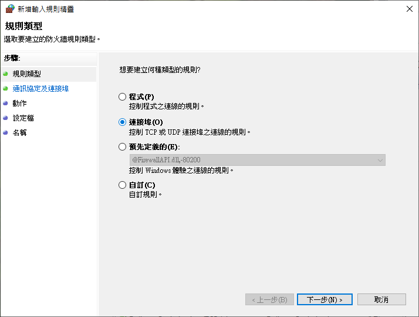

輸入1883連接埠進行設定
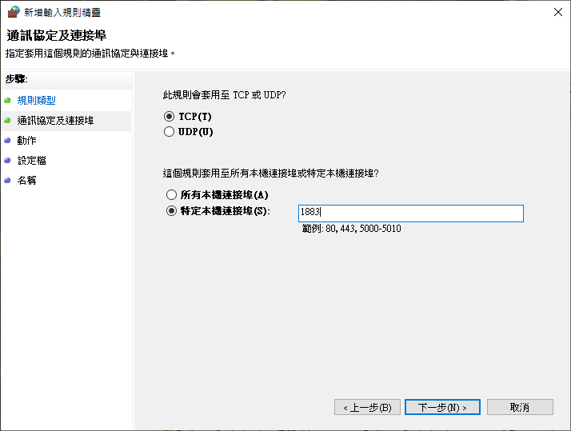

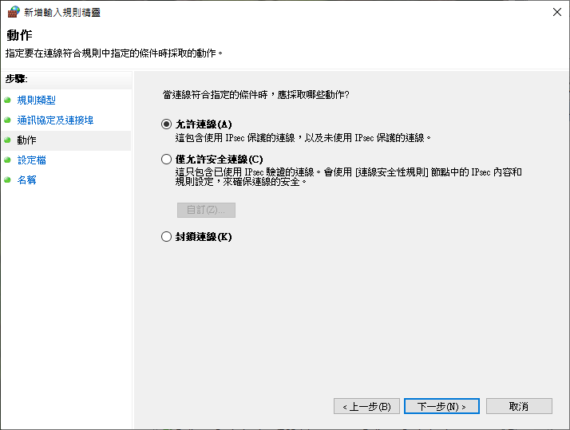

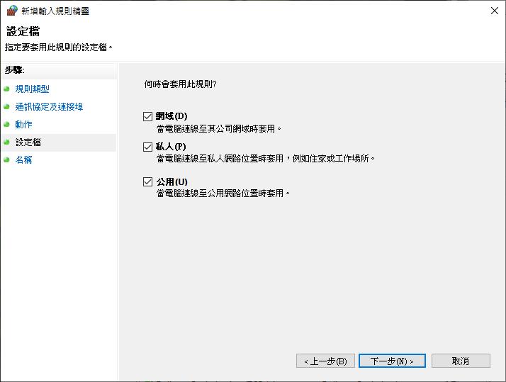
指定規則名稱
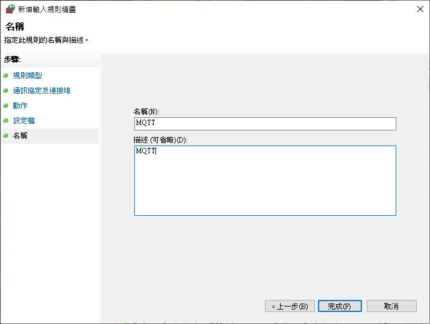

## 安裝完成
完成以上設定後就可以透過1883連接埠對MQTT Server進行連線啦