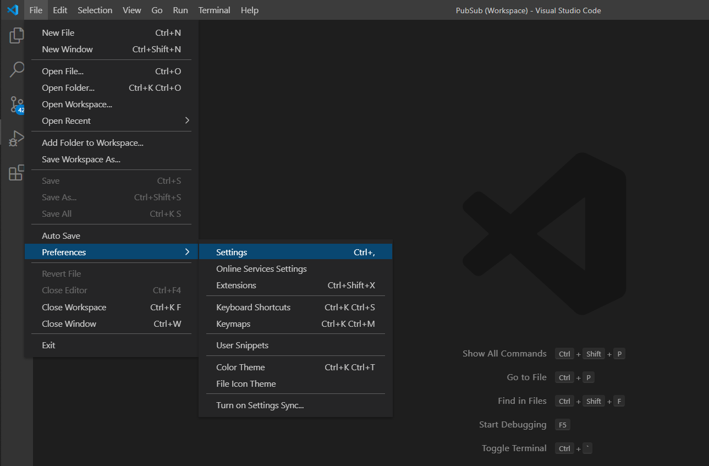
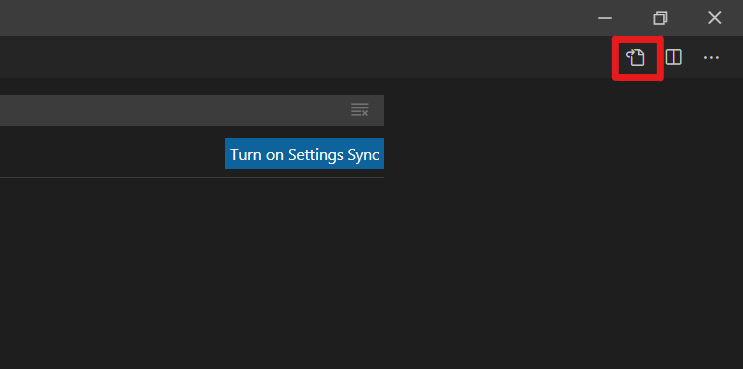
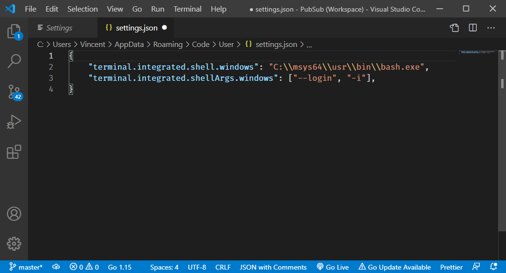
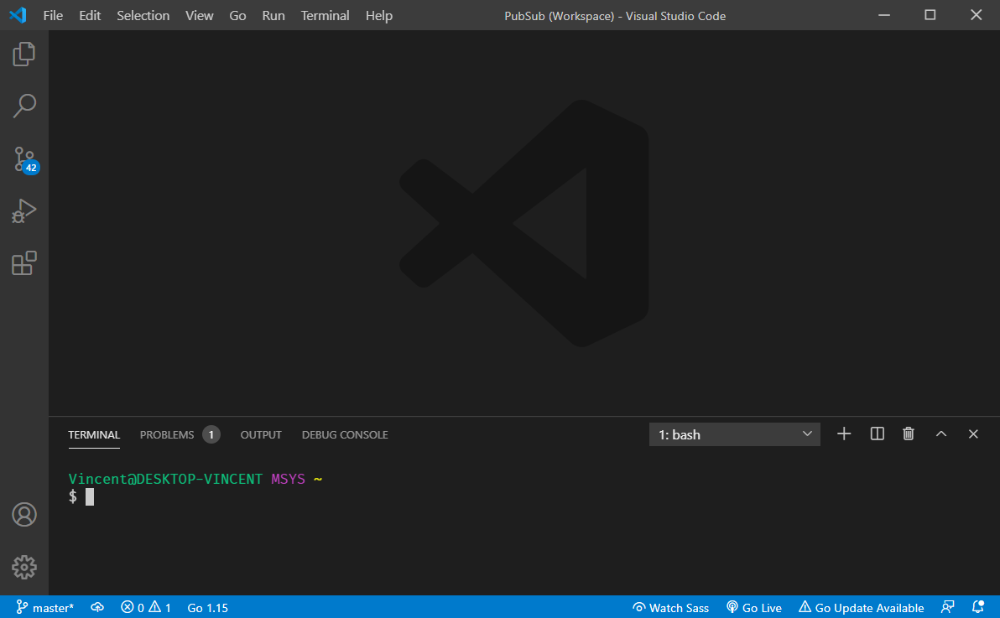

因為需要用到Makefile的緣故，而windows沒有提供相關的功能，所以希望能夠把Visual studio code預設的powershell改為MSYS作為終端機，便於make指令的操作

## 環境
- Windows10 x64 2004
- MSYS2
- Visual Studio Code 1.52.1


## 開啟Visual studio code的settings.json
### 開啟設定介面
#### 方法1 : 使用選單開啟
點選左上角的File > Preferences > Settings

#### 方法2 : 使用快捷鍵開啟
點擊空白處並按下快捷鍵`ctrl`+`,`

### 設定settings.json
點選右上角的OpenSettings(JSON)按鈕


### 在大括號中加入以下設定
```json
    "terminal.integrated.shell.windows": "C:\\msys64\\usr\\bin\\bash.exe",
    "terminal.integrated.shellArgs.windows": ["--login", "-i"],
```
*注意! "terminal.integrated.shell.windows"設定的路徑需依照自己電腦上MSYS的路徑進行設定*


### 完成
修改後重新開啟終端機就可以使用MSYS2作為終端機了
