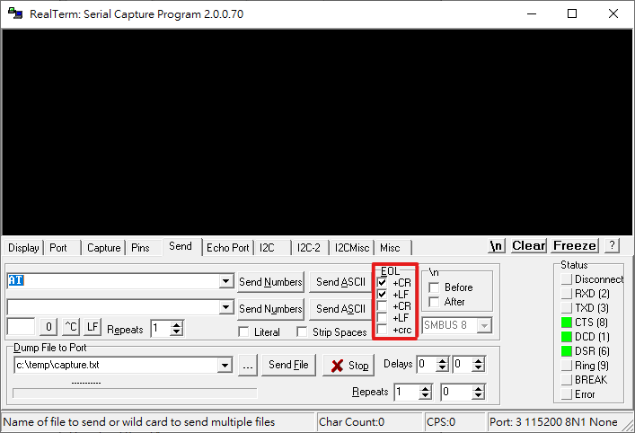

## 材料
### 硬體
- ESP-01s
- ESP-01燒錄器

### 軟體
- Flash Download Tools (ESP8266 & ESP32 & ESP32-S2) V3.8.5
- RealTerm 2.0.0.70

### SDK
- ESP8266 NONOS SDK V3.0.4

### AT指令集(含韌體燒錄位址說明)
- ESP8266 Non-OS AT Instruction Set V3.0.3

## 準備所需軟體及韌體
點擊下方連結下載燒錄工具、韌體及指令集
- [ESP8266 NONOS SDK](https://www.espressif.com/en/support/download/sdks-demos)
- [Flash Download Tools](https://www.espressif.com/en/support/download/other-tools)
- [ESP8266 Non-OS AT Instruction Set](https://www.espressif.com/en/support/documents/technical-documents)

## 連接ESP-01
將ESP-01插在燒錄器上，並將燒錄器插入USB Port
接著按下`Windows鍵+R`，輸入**devmgmt.msc**按下確定，進入裝置管理員查看燒錄器的COM Port(範例為COM7)

## 設定燒錄資訊
點擊`flash_download_tool_3.8.5.exe`執行燒錄程式

選擇`Developer Mode`

選擇`ESP8266 DownloadTool`

韌體燒錄位址表在`AT指令集`裡可以找到，在**1.2. Downloading AT Firmware into the Flash**裡的**1.2.4. 8 Mbit Flash**有詳細說明

解壓縮已經下載好的`ESP8266_NONOS_SDK-3.0.4`檔案，在裡面尋找bin資料夾，裡面的檔案就是燒錄所需的檔案，依照韌體燒錄位址表進行設定，將特定檔案對上相對的位址，並將左邊方格打勾

`FLASH SIZE`記得要改為8Mbit(ESP-01的Flash size為1MB，也就是8Mbit)

右下角的COM選單選擇剛才在裝置管理員看到的COM Port編號

BAUD設為**115200**

## 執行韌體燒錄程式

設定完成之後按下`START`按鈕便可開始進行燒錄

若有抓到ESP-01會顯示**Download下載中...**，後面的方格也會顯示ESP-01的MAC位址

若燒錄成功會顯示**FINISH完成**

## 檢查燒錄狀態
開啟RealTerm終端機程式

在**Display**頁籤設定Display As **Ansi**

在**Port**頁籤設定
- Baud為**115200**(若無回應可嘗試其他BaudRate)
- Port為USB燒錄器的COM Port編號(可至裝置管理員確認，或移除裝置後重新插上以便確認)
- 重新按壓Open按鈕，確認為壓下狀態(有任何更改都可以重新按壓，確保狀態有被改變)
- 確認右下角狀態是否正確

在**Send**頁籤**勾選EOL的前兩個**，輸入要傳送的指令後按下Send ASCII即可傳送指令
- AT - 測試AT是否已啟動
- AT+GMR - 查詢AT及SDK的版本資訊

若送出指令AT有返回OK，且送出指令AT+GMR有返回版本資訊便可開始使用ESP-01了

## 參考資料
[ESPRESSIF](https://www.espressif.com/en)
[ESP8266 NONOS SDK](https://www.espressif.com/en/support/download/sdks-demos)
[Flash Download Tools](https://www.espressif.com/en/support/download/other-tools)
[ESP8266 Non-OS AT Instruction Set](https://www.espressif.com/en/support/documents/technical-documents)