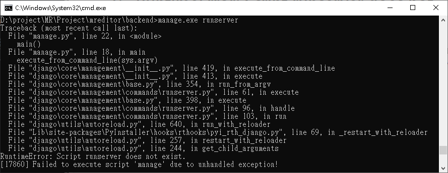
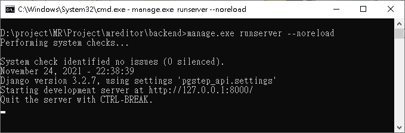

使用pyinstaller將manage.py打包後會產生manage.exe可執行檔，在執行`manage.exe runserver`指令時發生*RuntimeError: Script runserver does not exist.* 錯誤

## 環境
- Windows10 x64 20H2
- Python 3.9.7
- Django 3.2.7
- pyinstaller 4.7

## 解決方法
將指令加上 `--noreload` 參數，使用指令`manage.exe runserver --noreload`即可解決這個錯誤

