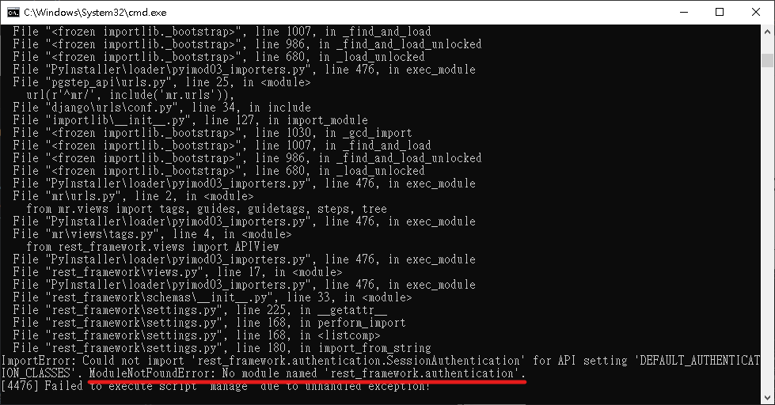
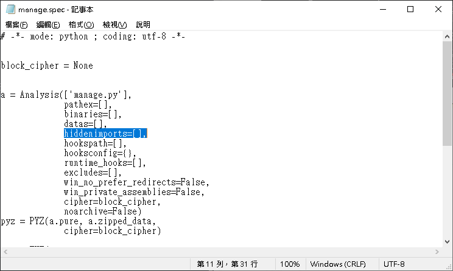
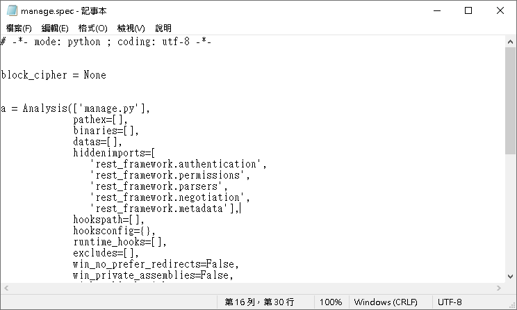
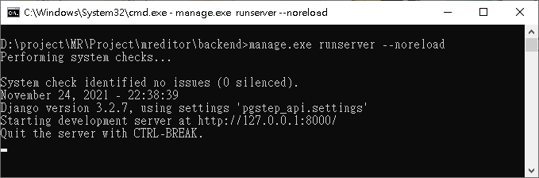

使用pyinstaller將manage.py打包後會產生manage.exe可執行檔，在執行`manage.exe runserver --noreload`指令時發生*ModuleNotFoundError: No module named 'XXX'.* 錯誤

## 環境
- Windows10 x64 20H2
- Python 3.9.7
- Django 3.2.7
- pyinstaller 4.7

## 解決方法
先前使用`pyinstaller -F .\manage.py`直接打包產生exe檔案，但是因為錯誤訊息提示缺少模組，其中一個解決方法是將錯誤訊息顯示的模組手動加入到hiddenimports中

首先使用`pyi-makespec -F .\manage.py`指令產生spec檔，在檔案裡的hiddenimports中加入錯誤訊息所提示的模組名稱

接著使用`pyinstaller -F .\manage.spec`指令將spec檔案打包成exe檔，再次使用`manage.exe runserver --noreload`指令執行顯示已可正常運作

