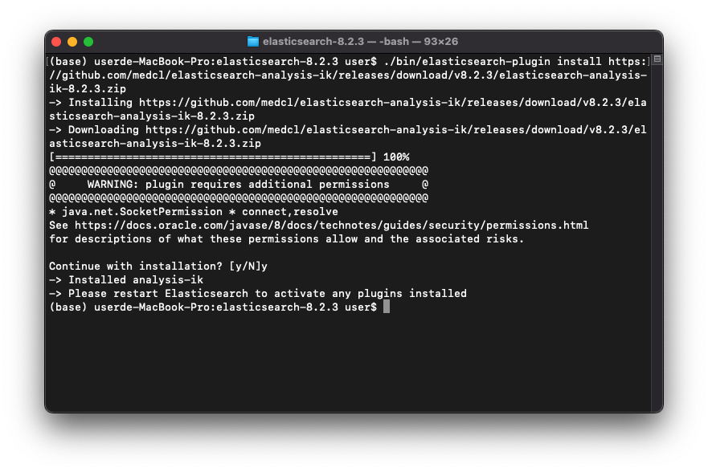

ElasticSearch是一個開源的且基於Lucene的全文搜尋引擎，其封裝Lucene並提供REST API，讓使用者可以更容易操作及使用。

## 環境
- macOS Monterey 12.4
- elasticsearch 8.2.3
- medcl/elasticsearch-analysis-ik 8.2.3

## 安裝
到[elasticsearch官網](https://www.elastic.co/downloads/elasticsearch)下載mac版本的壓縮檔，解壓縮後執行`bin/elasticsearch`檔案，elasticsearch便會啟動並在port9200提供服務

發送GET請求到9200port測試服務狀態
```bash
$ curl localhost:9200
```

### 安全性問題
:::warning
[WARN ][o.e.x.s.t.n.SecurityNetty4HttpServerTransport] [userde-MacBook-Pro.local] received plaintext http traffic on an https channel, closing connection Netty4HttpChannel{localAddress=/[0:0:0:0:0:0:0:1]:9200, remoteAddress=/[0:0:0:0:0:0:0:1]:52561}
:::
若出現以上錯誤訊息時可以先暫時先將elasticsearch.yaml中的`xpack.security.enabled`的選項設為false，測試完畢後務必恢復為true並進行正確的安全性設定

### 完成
若系統正常會返回下列訊息
```bash
#返回結果
{
  "name" : "userde-MacBook-Pro.local",
  "cluster_name" : "elasticsearch",
  "cluster_uuid" : "dx3b4E2jR_OjrKtB-ZMAlw",
  "version" : {
    "number" : "8.2.3",
    "build_flavor" : "default",
    "build_type" : "tar",
    "build_hash" : "9905bfb62a3f0b044948376b4f607f70a8a151b4",
    "build_date" : "2022-06-08T22:21:36.455508792Z",
    "build_snapshot" : false,
    "lucene_version" : "9.1.0",
    "minimum_wire_compatibility_version" : "7.17.0",
    "minimum_index_compatibility_version" : "7.0.0"
  },
  "tagline" : "You Know, for Search"
}

```

## 基本概念
ElasticSearch的最高單位是Index，相當於資料庫。在Index下會有很多Document，一個記錄稱為一個Document，Index包含了多個Document。

### Index
- 為ElasticSearch中的最高單位
- 相當於一個資料庫
- Index的名稱必須是小寫

### Document
- Document為一條記錄，Index下可以存放多個Document
- 每個Document的結構可以不同，但最好一樣，以提高搜尋速度

## Index操作

### 新增Index
```bash
# 新增一個名稱為customers的Index
$ curl -X PUT 'localhost:9200/customers'
```
```bash
#返回結果
{
    "acknowledged":true,
    "shards_acknowledged":true,
    "index":"customers"
}
```
若成功ElasticSearch會返回acknowledged為true的訊息

### 刪除Index
```bash
# 刪除名稱為customers的Index
$ curl -X DELETE 'localhost:9200/customers'
```
```bash
#返回結果
{
    "acknowledged":true
}
```
若成功一樣會返回acknowledged為true的訊息

## 分詞

### 安裝分詞插件
在使用全文搜索時若有使用中文內容的需求，需要安裝中文分詞插件
:::warning
分詞插件的版本號必須與ElasticSearch相同，否則無法指定分詞插件並且會跳出錯誤訊息（Failed to parse mapping: analyzer [ik_max_word] has not been configured in mappings）
:::
```bash!
$ ./bin/elasticsearch-plugin install https://github.com/medcl/elasticsearch-analysis-ik/releases/download/v8.2.3/elasticsearch-analysis-ik-8.2.3.zip
```
將上面指令的版本號換成與ElasticSearch相對應的版本號即可安裝
安裝完會顯示安裝成功訊息，重新開啟ElasticSearch即可


```
-> Installed analysis-ik
-> Please restart Elasticsearch to activate any plugins installed
```

### 設定分詞
在設定中文分詞（medcl/elasticsearch-analysis-ik）之前必須要先安裝插件
僅使用英文分詞的話不需要安裝插件，直接在`analyzer`和`search_analyzer`替換成內建的`standard`即可
```bash
$ curl \
-H "Content-Type: application/json" \
-X PUT 'localhost:9200/customers' \
-d '
{
    "mappings": 
    {
        "properties": {
            "name": 
            {
                "type": "text", 
                "analyzer": "ik_max_word",
                "search_analyzer": "ik_max_word"
            },
            "address": 
            {
                "type":"text", 
                "analyzer": "ik_max_word",
                "search_analyzer": "ik_max_word"
            },
            "room": 
            {
                "type": "text", 
                "analyzer": "ik_max_word",
                "search_analyzer": "ik_max_word"
            }
        }
    }
}'
```

```bash
# 返回結果
{"acknowledged":true,"shards_acknowledged":true,"index":"customers"}
```

## Document操作

### 新增Document
```bash
$ curl \
-H "Content-Type: application/json" \
-X POST 'localhost:9200/customers/_doc/1' \
-d '
{
  "name": "田中太郎2",
  "address": "北海道室蘭市水元町57-8",
  "room": "A303"
}'
```

```bash
# 返回結果
{
    "_index":"customers",
    "_id":"1",
    "_version":1,
    "result":"created",
    "_shards":{"total":2,"successful":1,"failed":0},
    "_seq_no":0,
    "_primary_term":1
}
```

### 刪除Document
```bash
# 刪除名稱為customers的Index
$ curl -X DELETE 'localhost:9200/customers/_doc/1'
```
```bash
#返回結果
{
    "_index":"customers",
    "_id":"1","_version":2,
    "result":"deleted",
    "_shards":
    {
        "total":2,
        "successful":1,
        "failed":0
    },
    "_seq_no":2,
    "_primary_term":1
}
```
若成功一樣會返回成功訊息

## 查詢操作

### 查詢所有Document
使用GET方法並在Index後方加上_search查詢所有Document
```bash
$ curl 'localhost:9200/customers/_search'
```

### 查詢特定Document
使用GET方法並加上Document的id，以查找特定id的資訊
```bash
$ curl 'localhost:9200/customers/_doc/1?pretty=true'
```

### 全文搜索
使用GET方法並使用query、match等關鍵字及要查找的欄位及內容進行查詢
```bash
$ curl \
-H "Content-Type: application/json" \
-X GET 'localhost:9200/customers/_search'  -d '
{
  "query" : { "match" : { "address" : "44" }}
}'
```

## 參考資料
- [全文搜索引擎 Elasticsearch 入门教程](https://www.ruanyifeng.com/blog/2017/08/elasticsearch.html)
- [A Practical Introduction to Elasticsearch](https://www.elastic.co/blog/a-practical-introduction-to-elasticsearch)