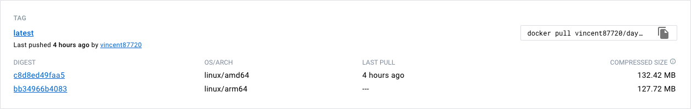

Synology的NAS可以安裝docker套件，下載映像檔使用。使用官方的映像檔可以正常執行，但使用自己製作的映像檔卻跳出了錯誤訊息`standard_init_linux.go:230: exec user process caused: exec format error`，搜尋過後發現與編譯平台有關，使用buildx將映像檔編譯為目標平台可以使用的映像檔便可以有效解決這個問題。

## 環境

建置環境
- macOS Ventura 13.0(Apple M1 Pro)
- Docker 20.10.21

部署環境
- Synology DSM 7.1.1(INTEL Celeron J4125)
- Docker 20.10.3

## 使用方法
要使用buildx建立多平台的映像檔，首先需要建立builder，並使用`--platform`參數帶入目標平台字串，即可建立多平台映像檔。

### 建立builder
建立並使用名稱為multiarch的builder
```
docker buildx create --name multiarch --use
```
使用`docker buildx ls`可列出目前的builder

### 建置並上傳
```
docker buildx build --rm --push\
    --platform linux/amd64,linux/arm64 \
    -t DOCKERHUB的使用者名稱/映像檔名稱:映像檔tag \
    -f 要用來進行建置的Dockerfile .
```
執行`docker buildx build`進行建置
`--rm`參數可以在執行結束後移除容器
`--push`參數可以在建置完成時推送映像檔到DockerHub
`--platform`參數指定目標平台，本次使用**linux/amd64**及**linux/arm64**作為目標平台
`-t`參數指定映像檔及映像檔標籤
`-f`參數指定要用來進行建置的Dockerfile

建置完成後前往DockerHub可以看到剛才指定平台的映像檔已成功建置並上傳

