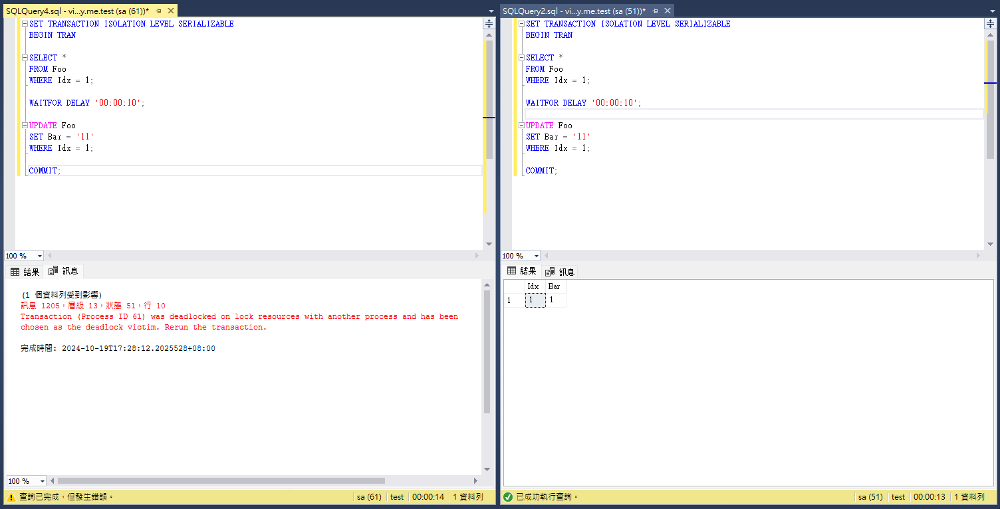
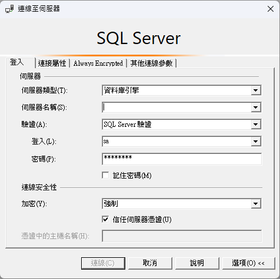
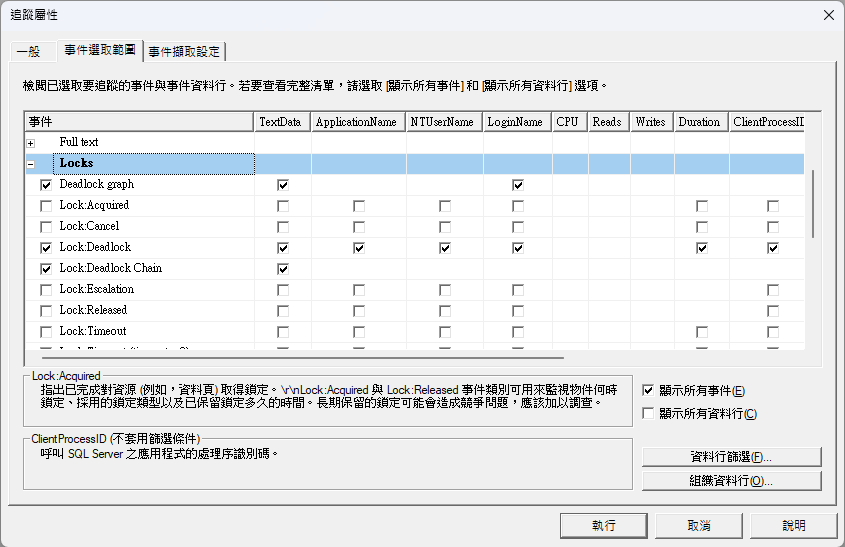
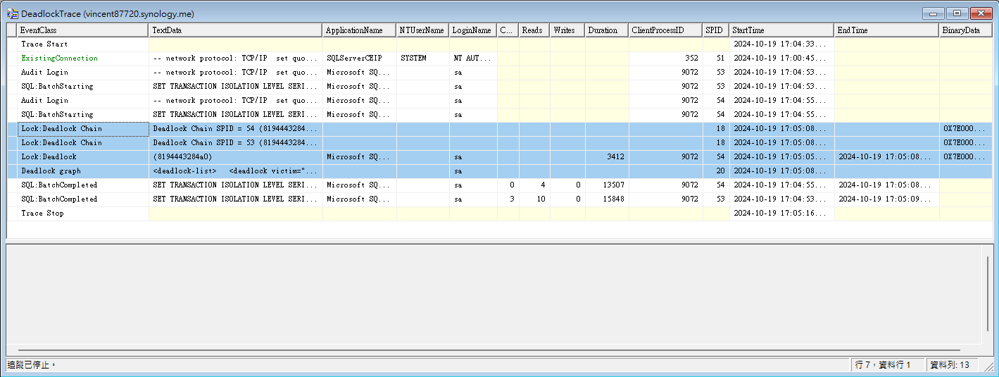
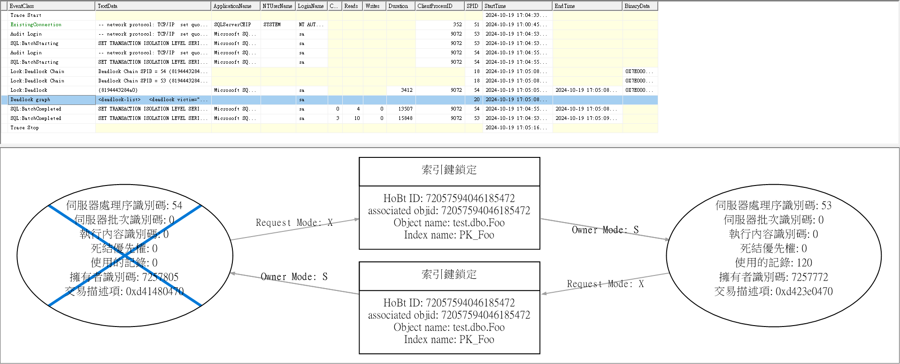
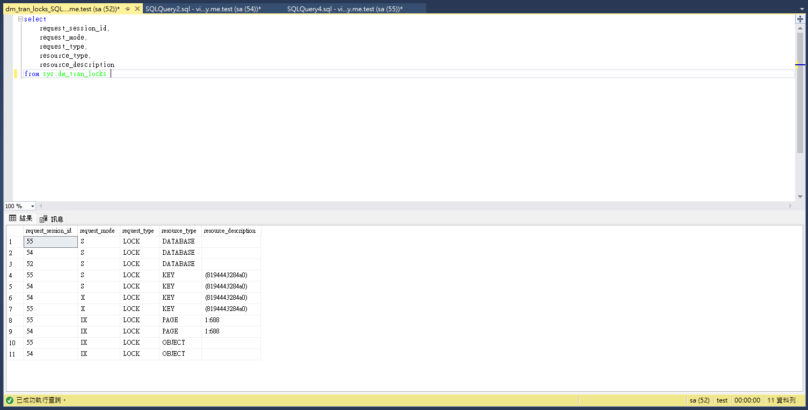

進入職場一年後，遇到了以前覺得在教科書上才會看到的恐怖事情－Deadlock。

事情發生在某個悠閒的午後，老闆突然在群組說客戶反應某些功能變得很慢，或是突然爆出很多錯誤。

事發當下我心想完蛋了，我完全對這個功能不熟，而且這功能剛好是我負責維護的，到底是有沒有這麼剛好......。

我忐忑的打開 Azure portal 查看監視計量區塊發生了什麼事，觀察到發生了大量的 Http Server Errors(500)（事後回去看在一小時內發生了大約1000個錯誤），並且 Http Response Time 也變得很長（在同樣的一個小時內平均回應時間是5.84秒，最長的回應時間有到20.99秒），是個不太正常的情況。

接著我看了Azure SQL 的監視，其實我不知道是啥問題，就一個一個計量點開來看，查看 DTU Percentage 計量時發現有很長一段時間 DTU Percentage 卡在100%下不來，並且查看 Deadlock 時發現同一個小時內發生了50次的 Deadlock。到這邊大致上可以猜測到是 Deadlock 引發的一連串效能問題。

為了進一步確認問題點我點開當天的 Log 查看詳細的錯誤訊息，打開 Log 後看到一大串的 Deadlock 和 Timeout 錯誤訊息，當天的 Log 中有一個函式發生大量的 Deadlock，有兩個函式發生少量的 Deadlock，並且還有一個函式發生大量的 Timeout。

知道是哪幾支API發生問題後，我閱讀了其中一支發生大量 Deadlock 的函式，這個函式在做的是更新某筆資料的狀態，在更新前會先取得該筆資料，並且取得與該筆資料相關的其他資料表的資料來判斷是否可以更新狀態，若都合法最後才會更新狀態。

一看到這段程式我第一個直覺是隔離等級（ISOLATION LEVEL）設為 SERIALIZABLE 導致的，因為隔離等級太高而發生了大量的 Deadlock，但是其中一個前輩覺得這個 Deadlock 與隔離等級並沒有太大的關係，這位前輩建議我使用 Lock 把發生大量 Deadlock 的這段程式匡起來，以避免多人使用造成 Deadlock 繼續發生。

使用 Lock 確實有助於降低 Deadlock 發生的機率，但這時我腦海又浮出很多問題，包括：
1. 發生死結的真正原因到底是什麼？
2. 到底是誰跟誰發生了死結？
3. 使用 Lock 雖然簡單快速且有效，但是有沒有更好的解決辦法？

這幾個問題在發生死結問題後一直在我的腦袋中浮現，困擾我許久，我決定來找出 Deadlock 的原因！

## 模擬事發現場

為了還原 Deadlock 的發生情境，我找出發生 Deadlock 的那段程式碼的SQL指令，把這段 SQL 貼到 AzureDataStudio 的命令視窗內，爲了讓 Deadlock 比較容易發生，我在指令內加入`waitfor delay '00:00:10`放慢執行時間，果然發生 Deadlock 了！但是DB只跟我說哪個交易在 Deadlock 中犧牲了，並沒有跟我說到底為什麼會發生 Deadlock。礙於我的裝置是 Mac，就算使用 AzureDataStudio 內的 SQL Server Profiler Extension 也無法擷取 Deadlock 的事件，於是我使用 Windows 版本的 SQL Server Profiler 進行排查。

使用 Windows 版本的 SQL Server Profiler 可以成功擷取到 Deadlock 事件，觀察 Deadlock 事件後我發現原來這段 SQL 裡面是同一個表在打架，我用一個簡單的模擬的表來說明這次的情況。

首先建立`Foo`資料表，並且在資料表中加入三筆資料
```sql
CREATE TABLE Foo(
	Idx int IDENTITY(1,1) NOT NULL,
	Bar nvarchar(10) NOT NULL,
	CONSTRAINT PK_Foo PRIMARY KEY CLUSTERED (Idx ASC)
)

INSERT INTO Foo(Bar)
VALUES('1'),('2'),('3');
```

為了模擬兩個打架的交易，將讀取資料、等待和更新資料的指令使用`SERIALIZABLE`等級的交易包起來，開啟兩個查詢並且前後快速按下執行。
```sql
SET TRANSACTION ISOLATION LEVEL SERIALIZABLE
BEGIN TRAN

SELECT *
FROM Foo
WHERE Idx = 1;

WAITFOR DELAY '00:00:10';

UPDATE Foo
SET Bar = '11'
WHERE Idx = 1;

COMMIT;
```



我們可以發現兩個交易中有其中一個交易成功，另一個交易被選為 Deadlock 的犧牲者失敗了，到這裡成功讓 Deadlock 出現了，但如果想進一步得知 Deadlock 的詳細資訊和鎖定的情形，我們必須使用到 SQL Server Profiler 和 sys.dm_tran_locks 資料表來查詢詳細的情況。

## 監視 Deadlock 事件

想要查看 Deadlock 的詳細資訊，我們可以使用 SQL Server Profiler 來擷取 Deadlock 事件。
首先連線至要測試的資料庫



選擇想要監視的事件，點選「顯示所有事件(E)」可以看到列表中多出許多事件。在事件列表中找到 Locks 區塊，勾選「Deadlock graph」、「Lock:Deadlock」及「Lock:Deadlock Chain」事件。



按下執行後便會開始擷取事件，這時回到 SSMS 對兩個查詢分別按下執行，等待 Deadlock 發生後便會在列表中看到 Deadlock 事件。



點選 Deadlock graph 後會在下方看到鎖死圖，可以觀察到兩個交易都分別拿到 SharedLock，並且都嘗試要取得 XLock，雙方都在等對方把 SharedLock 釋放，這時候 Deadlock 就發生了。



## 查詢鎖定資訊

如果想要進一步查詢鎖定的情況，可以從`sys.dm_tran_locks`資料表查詢各個交易的鎖定情況。

```sql
SELECT 
    request_session_id, 
    request_mode, 
    request_type, 
    resource_type, 
    resource_description 
FROM sys.dm_tran_locks 
```



## 解決鎖死的方法

遇到鎖死可以嘗試使用以下方法避免鎖死：

1. 縮短交易的時間：只在交易中執行必要的程式，縮短交易時間，避免鎖定時間過長。
2. 縮小鎖定的粒度：鎖定包含 ROW、KEY、TABLE 或 DATABASE 等各種粒度，使用適合的粒度可以避免鎖定的範圍過大。
3. 降低交易隔離等級：交易隔離等級越高，發生 Deadlock 的機率也越高，可依照業務需求選用最低可滿足需求的交易隔離等級。

這次我遇到的 Deadlock 剛好可以在交易隔離等級選用 ReadCommitted 的情況下正常運作，將交易隔離等級改為 ReadCommitted 後確實就沒有再發生 Deadlock 了，不過還是要依照業務邏輯與需求選用適合的 Deadlock 解決方案。

###### 參考資料
- [鎖死指南]
- [Deadlocks: Lets Do One, Understand It, and Fix It]
- [Deadlocked!]
- [SQL Server - 鎖定類型介紹]
- [【茶包射手日記】只涉及單一資料表的Deadlock]

[鎖死指南]: https://learn.microsoft.com/zh-tw/sql/relational-databases/sql-server-deadlocks-guide?view=sql-server-ver16
[Deadlocks: Lets Do One, Understand It, and Fix It]: https://www.youtube.com/watch?v=3EwDn9hqgkg
[Deadlocked!]: https://blog.codinghorror.com/deadlocked/
[SQL Server - 鎖定類型介紹]: https://caryhsu.blogspot.com/2011/09/sql-server.html
[【茶包射手日記】只涉及單一資料表的Deadlock]: https://blog.darkthread.net/blog/single-table-deadlock/